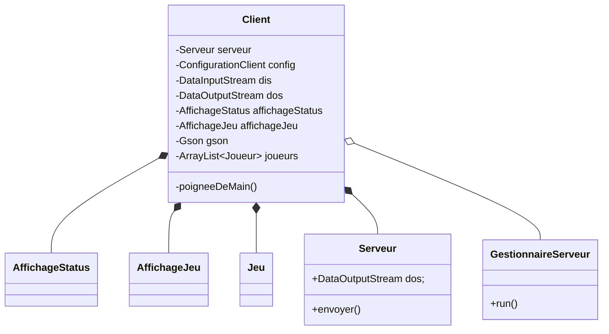

```mermaid
classDiagram
    class Client {
        -Serveur serveur
        -ConfigurationClient config
        -DataInputStream dis
        -DataOutputStream dos
        -AffichageStatus affichageStatus
        -AffichageJeu affichageJeu
        -Gson gson
        -ArrayList~Joueur~ joueurs
        -poigneeDeMain()
    }
    class GestionnaireServeur {
        +run()
    }
    class Serveur {
        +DataOutputStream dos;
        +envoyer()
    }
    class AffichageStatus
    class AffichageJeu
    Client *-- AffichageStatus
    Client *-- AffichageJeu
    Client *-- Jeu
    Client *-- Serveur
    Client o-- GestionnaireServeur
```
