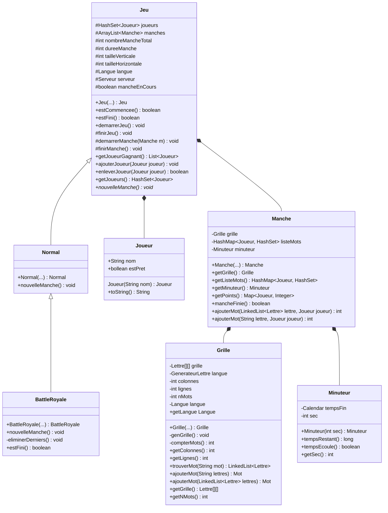

```mermaid
classDiagram
    class Jeu {
        #HashSet~Joueur~ joueurs
        #ArrayList~Manche~ manches
        #int nombreMancheTotal
        #int dureeManche
        #int tailleVerticale
        #int tailleHorizontale
        #Langue langue
        #Serveur serveur
        #boolean mancheEnCours
        +Jeu(...) Jeu
        +estCommencee() boolean
        +estFini() boolean
        +demarrerJeu() void
        #finirJeu() void
        #demarrerManche(Manche m) void
        #finirManche() void
        +getJoueurGagnant() List~Joueur~
        +ajouterJoueur(Joueur joueur) void
        +enleverJoueur(Joueur joueur) boolean
        +getJoueurs() HashSet~Joueur~
        +nouvelleManche()* void
    }
    class Normal {
        +Normal(...) Normal
        +nouvelleManche() void
    }
    class BattleRoyale {
        +BattleRoyale(...) BattleRoyale
        +nouvelleManche() void
        -eliminerDerniers() void
        +estFini() boolean
    }
    class Joueur {
        +String nom
        +bollean estPret
        Joueur(String nom) Joueur
        +toString() String
    }
    class Manche {
        -Grille grille
        -HashMap~Joueur, HashSet~ listeMots
        -Minuteur minuteur
        +Manche(...) Manche
        +getGrille() Grille
        +getListeMots() HashMap~Joueur, HashSet~
        +getMinuteur() Minuteur
        +getPoints() Map~Joueur, Integer~
        +mancheFinie() boolean
        +ajouterMot(LinkedList~Lettre~ lettre, Joueur joueur) int
        +ajouterMot(String lettre, Joueur joueur) int
    }
    class Grille {
        -Lettre[][] grille
        -GenerateurLettre langue
        -int colonnes
        -int lignes
        -int nMots
        -Langue langue
        +Grille(...) Grille
        -genGrille() void
        -compterMots() int
        +getColonnes() int
        +getLignes() int
        +getLangue Langue
        +trouverMot(String mot) LinkedList~Lettre~
        +ajouterMot(String lettres) Mot
        +ajouterMot(LinkedList~Lettre~ lettres) Mot
        +getGrille() Lettre[][]
        +getNMots() int
    }
    class Minuteur {
        -Calendar tempsFin
        -int sec
        +Minuteur(int sec) Minuteur
        +tempsRestant() long
        +tempsEcoule() boolean
        +getSec() int
    }
    Jeu <|-- Normal
    Normal <|-- BattleRoyale
    Jeu *-- Joueur
    Jeu *-- Manche
    Manche *-- Grille
    Manche *-- Minuteur
```
