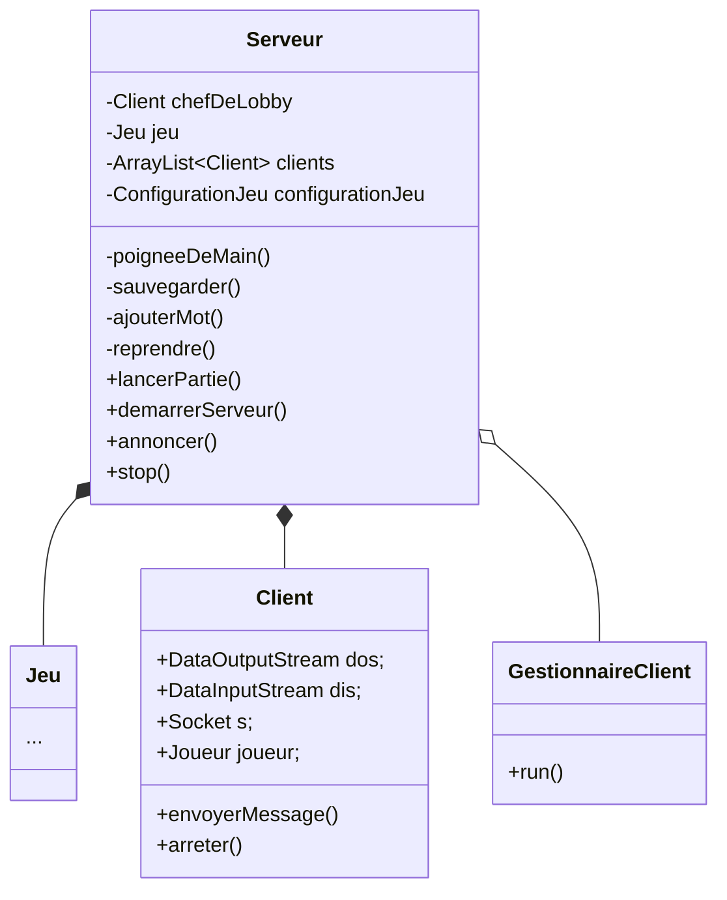

```mermaid
classDiagram
    class Serveur {
        -Client chefDeLobby
        -Jeu jeu
        -ArrayList~Client~ clients
        -ConfigurationJeu configurationJeu
        -poigneeDeMain()
        -sauvegarder()
        -ajouterMot()
        -reprendre()
        +lancerPartie()
        +demarrerServeur()
        +annoncer()
        +stop()
    }
    class GestionnaireClient {
        +run()
    }
    class Client {
        +DataOutputStream dos;
        +DataInputStream dis;
        +Socket s;
        +Joueur joueur;
        +envoyerMessage()
        +arreter()
    }
    class Jeu {
        ...
    }
    class Client
    Serveur *-- Jeu
    Serveur *-- Client
    Serveur o-- GestionnaireClient
```
